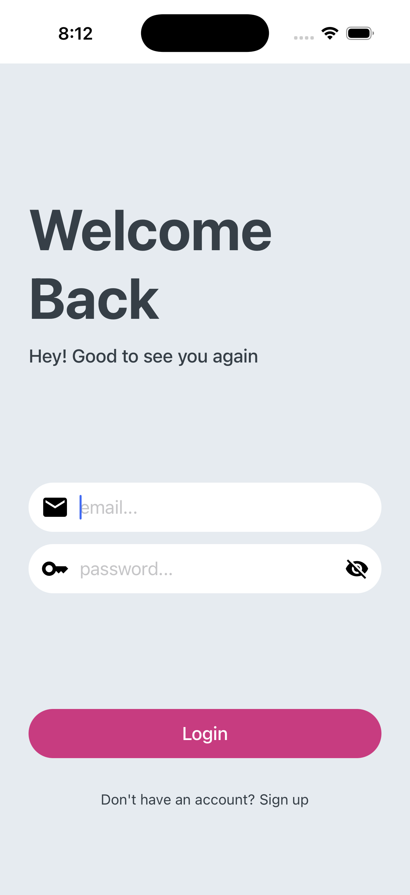
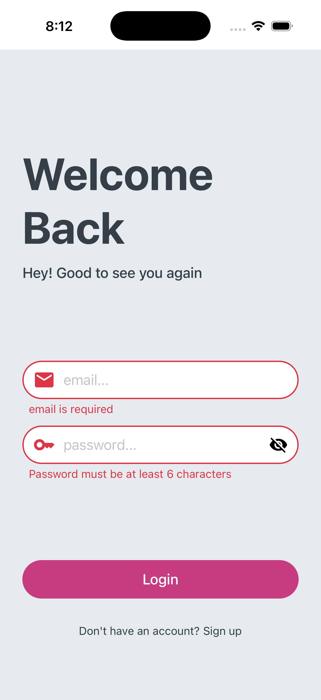
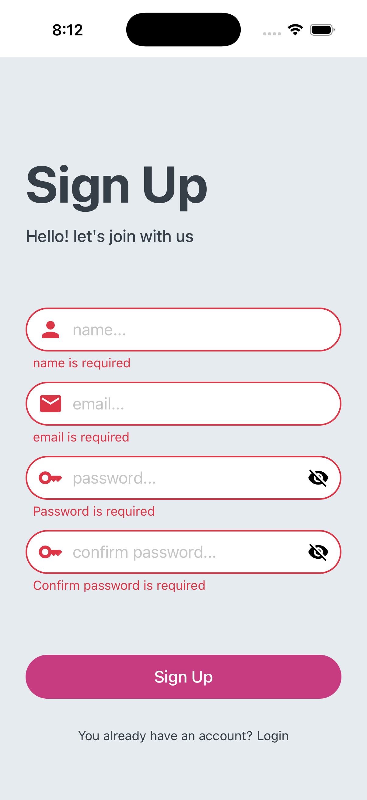
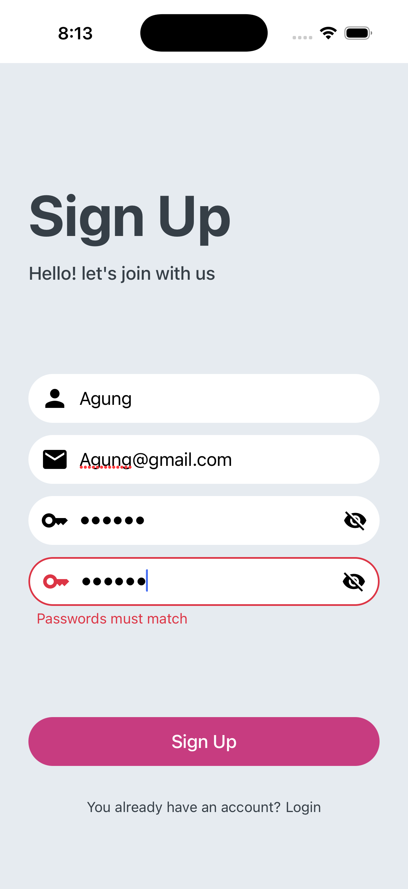
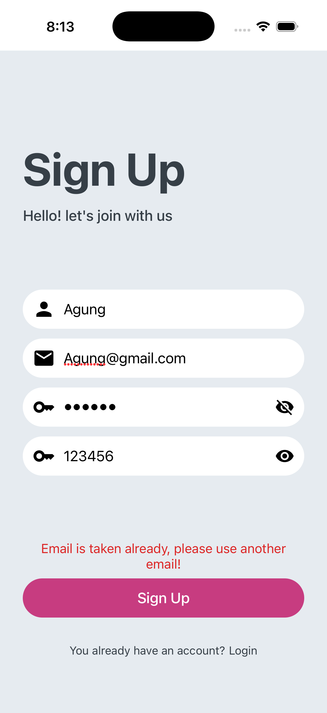
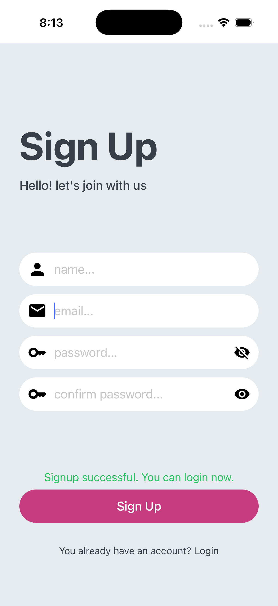
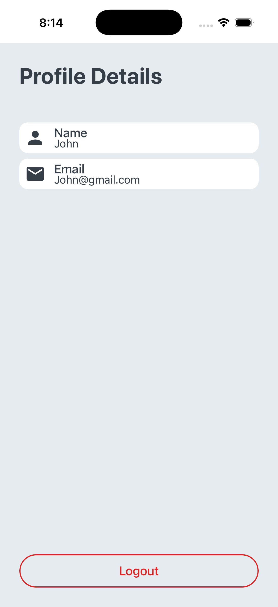

# Simple Authentication App

A minimal React Native authentication flow with local persistence, built to demo login/registration, protected navigation, and basic profile viewing.

## Features
- Login screen with form validation
- Signup screen with form validation
- Home screen displaying basic profile info
- One-tap logout to clear the session

## Tech Stack
- React Native 0.83.x, React 19
- TypeScript
- React Navigation (native-stack)
- AsyncStorage
- Yup

## Setup
```sh
# install JS deps
npm install

# iOS only (from project root)
cd ios && pod install && cd ..
```

## Running the app
Start Metro (in one terminal):
```sh
npm start
```

Android:
```sh
npm run android
```

iOS:
```sh
npm run ios
```

## Screenshots

**Login**
|  |  |
| --- | --- |
|  |  |

**Signup**
|  |  |  |
| --- | --- | --- |
|  |  |  |
|  |  | &nbsp; |

**Home**
|  |
| --- |
|  |
